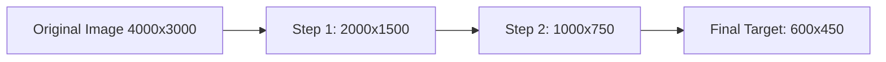

# ⚡ ImgFormatter Pro

> **Privacy-First, Ultra-Fast Client-Side Image Converter, Optimizer & Precision Formatter**


[](https://reactjs.org/)
[](https://www.typescriptlang.org/)
[](https://vitejs.dev/)
[](https://tailwindcss.com/)
[](LICENSE)

---

## 🎯 Purpose & Overview

**ImgFormatter Pro** is a modern, high-performance web tool built to solve everyday image processing problems without compromising user privacy. 

Most online image tools force users to upload sensitive personal photos, ID cards, document scans, and graphics to external remote servers for conversion. **ImgFormatter Pro processes 100% of images directly inside the user's browser.** No images or metadata ever leave the device.

### Core Problems Solved:
- **Strict Size Limits:** Compressing images to strict KB requirements (e.g., `< 20 KB` or `< 50 KB` for government portals, job applications, or university forms).
- **Format Transcoding:** Fast batch conversion across modern and legacy image formats (`WebP`, `AVIF`, `PNG`, `JPEG`, `ICO`, `BMP`, `SVG`).
- **Aspect Ratio & Dimension Control:** Precise scaling, fixed width/height resizing, and custom matte backgrounds.
- **Watermarking:** Applying crisp copyright or watermark text with custom opacity before exporting.

---

## 🚀 Key Features

* 🔒 **100% Client-Side & Private:** Zero server uploads, zero API latency, works completely offline.
* ⚡ **Batch Processing:** Drag & drop dozens of images simultaneously and convert in parallel.
* 🎯 **Smart Target Size Budgeting:** Specify an exact target file size in KB; the binary-search optimization engine automatically tunes compression and dimensions to hit your target.
* 📐 **Custom Dimensions & Resizing:** Scale by percentage (`10% - 200%`) or lock exact width × height pixel dimensions.
* 🎨 **Matte Color Filling:** Custom matte background fill (e.g., solid white) when converting transparent PNGs into non-alpha formats like JPEG or BMP.
* 💧 **Custom Watermarking:** Dynamic canvas text overlay with customizable opacity.
* 🔍 **Interactive Side-by-Side Comparison:** Live before/after split-pane zoom modal to inspect image quality.
* 📦 **One-Click Batch ZIP Download:** Package all converted assets with sanitized file naming into a single `.zip` file using `JSZip`.

---

## 🔬 Under the Hood: Image Conversion & Formatting Logics

The core conversion engine resides in [`src/lib/imageConverter.ts`](src/lib/imageConverter.ts). Below is an in-depth breakdown of the algorithms and binary encoders used:

### 1. Progressive Step-Down Scaling (Anti-Aliasing Pipeline)
When drastically downscaling large images (such as 48MP smartphone photos down to web or thumbnail resolutions), standard single-pass canvas scaling produces severe pixel aliasing, jagged lines, and moiré artifacts.

**Algorithm:**
* ImgFormatter Pro applies **progressive multi-step halving**:
  $$\text{Next Width} = \max(\text{Target Width}, \lfloor\text{Current Width} \times 0.5\rfloor)$$
* Iteratively renders down by at most 50% per step using `imageSmoothingQuality = 'high'` until reaching the target dimensions.
* Results in razor-sharp edges and smooth gradients free of downsampling artifacts.



---

### 2. Smart Target Size Optimizer (Binary Search Algorithm)
In `Target Size (KB)` mode, the converter determines the optimal quality factor and dimensions required to meet a strict byte budget:

1. **Pre-scaling Heuristic:** If the target budget is ultra-tight ($\le 25\text{ KB}$ or $\le 50\text{ KB}$) on a multi-megapixel image, the engine pre-scales maximum dimensions to prevent memory exhaustion and blocky JPEG artifacts.
2. **Quality Binary Search (8 Iterations):**
   * Sets boundaries `low = 10` and `high = 95`.
   * Tests midpoint quality `mid = (low + high) / 2`.
   * If `testBlob.size <= targetBytes`, stores as best candidate and attempts higher quality (`low = mid + 1`).
   * Otherwise, steps down quality (`high = mid - 1`).
3. **Dimension Downscale Fallback:** If minimum lossy quality still exceeds target bytes (or when compressing lossless formats like PNG/BMP), the algorithm dynamically reduces canvas dimensions by factors of `0.85x` until the budget is satisfied.

---

### 3. Native Binary Encoders

#### 🪟 Windows Icon (`.ico`) Engine (Universal 32-bit DIB)
Standard browsers, Windows Explorer, Paint, and desktop image viewers fail when opening `.ico` files containing compressed PNG streams. ImgFormatter Pro features a native binary generator that constructs genuine **32-bit Device Independent Bitmap (DIB)** icons:
* Constrains dimensions strictly to the $\le 256 \times 256\text{ px}$ ICO specification.
* Direct memory allocation with `ArrayBuffer` and `DataView`:
  * **`ICONDIR` Header (6 bytes):** Defines type and image count.
  * **`ICONDIRENTRY` (16 bytes):** Specifies dimensions, 32-bit depth, byte count, and offset.
  * **`BITMAPINFOHEADER` (40 bytes):** Sets `biHeight = height * 2` (spec requirement for XOR + AND masks).
  * **BGRA Pixel Stream:** Bottom-to-top pixel ordering with full 8-bit alpha transparency.
  * **AND Mask:** 1-bit scanline padded transparency mask.

#### 🖼️ Authentic 24-bit Uncompressed BMP Generator
* Creates true 24-bit RGB Windows Bitmap files directly from canvas pixel buffers.
* Computes strict 4-byte boundary row padding:
  $$\text{Row Size} = \left\lfloor\frac{24 \times \text{width} + 31}{32}\right\rfloor \times 4$$
* Writes standard 54-byte BMP header followed by inverted bottom-up BGR scanlines.

#### 🌐 Vector SVG Container
* Wraps high-resolution raster image data URLs inside an XML vector SVG wrapper, maintaining viewports and aspect ratios.

---

## 🛠️ Technology Stack

| Layer | Technology |
| :--- | :--- |
| **Framework** | [React 18](https://react.dev/) + [TypeScript](https://www.typescriptlang.org/) |
| **Build Tool** | [Vite 5](https://vitejs.dev/) |
| **Styling** | [Tailwind CSS 3](https://tailwindcss.com/) with Custom Dark Glassmorphism |
| **Icons** | [Lucide React](https://lucide.dev/) |
| **Archiving** | [JSZip](https://stuk.github.io/jszip/) for in-memory client-side ZIP bundle creation |
| **Canvas APIs** | Native HTML5 Canvas 2D Context + TypedArrays (`ArrayBuffer`, `DataView`, `Uint8Array`) |

---

## 📂 Project Structure

```
imageconverter/
├── public/
│   ├── icon.ico            # 32-bit desktop & tab favicon
│   ├── icon.svg            # Scalable vector favicon
│   ├── favicon.ico         # Root fallback icon
│   └── imgformatterpro.png # App banner & branding asset
├── src/
│   ├── components/
│   │   ├── CompareModal.tsx # Side-by-side before/after preview modal
│   │   ├── DropZone.tsx     # Drag & drop upload area with multi-file picker
│   │   ├── SettingsBar.tsx  # Format, quality, size budget & dimension controls
│   │   └── TaskCard.tsx     # Individual image task status & action card
│   ├── lib/
│   │   └── imageConverter.ts # Core conversion engine, binary encoders & optimizers
│   ├── types.ts             # TypeScript interfaces and data models
│   ├── App.tsx              # Main application layout & batch state manager
│   ├── index.css            # Tailwind & glassmorphism theme styling
│   └── main.tsx             # React DOM entry point
├── index.html               # Main HTML entry with SEO & favicon tags
├── vite.config.ts           # Vite bundler configuration
└── package.json             # Project dependencies and npm scripts
```

---

## 💻 Getting Started Locally

### Prerequisites
* **Node.js** (v18.0.0 or later)
* **npm** (v9.0.0 or later)

### Installation

1. **Clone the repository:**
   ```bash
   git clone https://github.com/JastiRaja/imgformatterpro.git
   cd imgformatterpro
   ```

2. **Install dependencies:**
   ```bash
   npm install
   ```

3. **Start the local development server:**
   ```bash
   npm run dev
   ```
   Open [http://localhost:5173](http://localhost:5173) in your browser.

4. **Build for production:**
   ```bash
   npm run build
   ```

5. **Run typecheck & linting:**
   ```bash
   npm run typecheck
   npm run lint
   ```

---

## 🔒 Privacy & Security

* **Zero Tracking:** No user data or analytics are collected.
* **No Server Processing:** All rendering, transcoding, and compression happen entirely within the browser's sandbox using the Canvas and Blob APIs.
* **Memory Management:** Object URLs created for previews and downloads are explicitly revoked (`URL.revokeObjectURL`) to prevent memory leaks during large batch tasks.

---

## 📄 License

This project is licensed under the **MIT License**. Free to use, modify, and distribute.